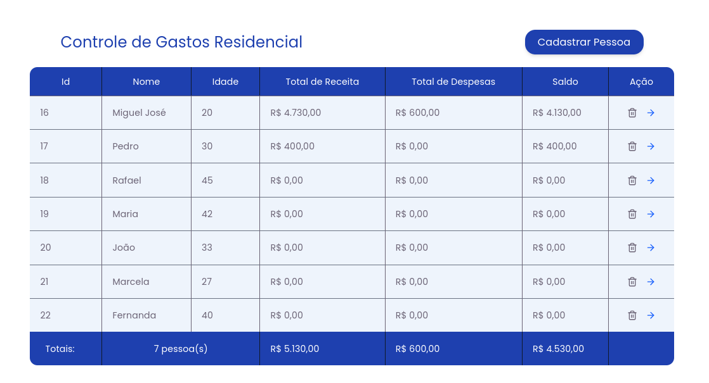
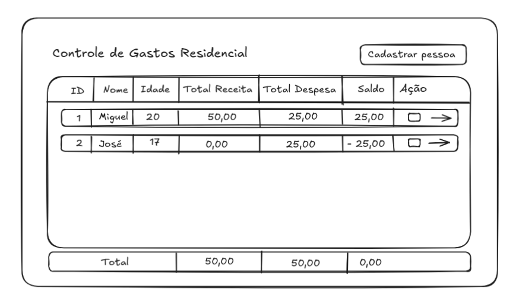
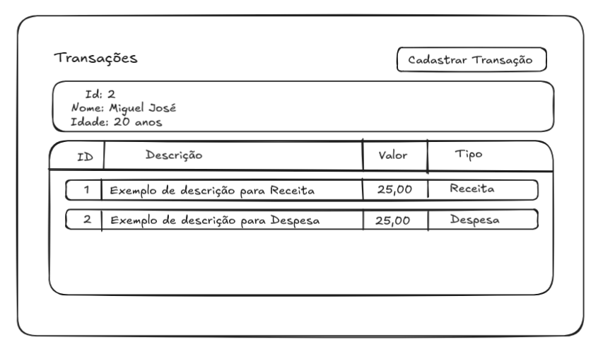
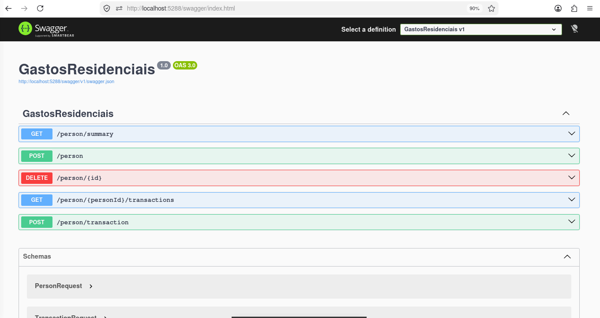

# 💰 Controle de Gastos Residenciais

Sistema desenvolvido para gerenciar receitas e despesas de uma residência, permitindo cadastrar pessoas, registrar transações financeiras e visualizar um resumo consolidado dos gastos.

O objetivo do projeto é aplicar boas práticas de desenvolvimento Full Stack utilizando **C# .NET** no backend e **React + TypeScript** no frontend.

---

## 📷 Tela Principal

<p align="center">
  
</p>

A tela principal apresenta um resumo financeiro de todas as pessoas cadastradas, permitindo visualizar rapidamente:

* Valor total de receitas;
* Valor total de despesas;
* Saldo individual;
* Listagem de pessoas;
* Ações para cadastro e gerenciamento.

---

# ✨ Funcionalidades

* ✅ Cadastro de Pessoas
* ✅ Cadastro de Transações (Receitas e Despesas)
* ✅ Consulta de saldo por pessoa e Resumo Total
* ✅ API REST documentada com Swagger

---

# 🖼️ Wireframe

Durante o planejamento inicial da aplicação foi criado um wireframe para definir a disposição dos componentes e fluxo da interface.

<p align="center">
  
</p>
<p align="center">
  
</p>

---

# 📑 Documentação da API

A API possui documentação automática através do Swagger.

<p align="center">
  
</p>

É possível testar todos os endpoints diretamente pelo navegador.

---

# 🏗️ Arquitetura

O projeto segue uma arquitetura em camadas, separando responsabilidades entre API, regras de negócio e persistência.

```text
React + TypeScript
        │
        ▼
 ASP.NET Core Web API
        │
        ▼
Endpoints
        │
        ▼
Regras de Negócio
        │
        ▼
Entity Framework Core
        │
        ▼
SQLite
```

### Backend

* Endpoints Minimal API
* Entity Framework Core
* SQLite
* DTOs para comunicação
* Validação de dados
* Mapeamento de entidades

### Frontend

* React
* TypeScript
* Tailwind CSS
* Axios
* Componentização
* Consumo da API REST

---

# ⚙️ Tecnologias

### Backend

* C#
* .NET
* ASP.NET Core Minimal API
* Entity Framework Core
* SQLite
* Swagger

### Frontend

* React
* TypeScript
* Tailwind CSS
* Axios
* Vite

---

# 📁 Estrutura

```text
📦 Controle-Gastos-Residenciais

├── backend
│   ├── Routes
│   ├── Models
│   ├── DTO
│   ├── Repository
│   ├── Migrations
│   └── Database
│
├── frontend
│   ├── components
│   ├── hooks
│   ├── services
│   ├── pages
│   ├── utils
│   └── assets
│
└── README.md
```

---

# ▶️ Executando o projeto

## Backend

```bash
dotnet restore
dotnet ef database update
dotnet run
```
---

## Frontend
Deve-se copiar o env.example e criar o .env antes.
```bash

npm install
npm run dev
```
---


# 📸 Mais imagens

Você pode adicionar outras capturas da aplicação para mostrar diferentes funcionalidades.

<p align="center">
  
</p>

<p align="center">
  
</p>

---

## 👨‍💻 Autor

Desenvolvido como projeto de estudo para praticar desenvolvimento Full Stack utilizando **ASP.NET Core**, **React** e **TypeScript**.
